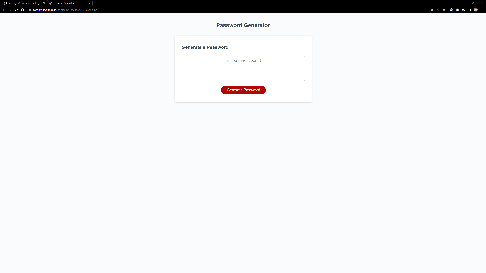

# <bootcamp-challenge03-html_css>

## Description

My motivation for this project is to make a password generator. It is very simple to use and prompts the user for different criteria they would like in their password and generates a password that fits that criteria. The user must input at least one criteria and give a valid password length. 

## Installation

The webpage is available at https://zachcygan.github.io/bootcamp-challenge03-javascript/. To view the source code within your browser, press F12 or right click the webpage and select "inspect" on windows. For MacOS,  press Command+Option+I or fn F12 (MacOS) to open Chrome DevTools. You can view any elements on the webpage or any of the styling by selecting the corresponding section in Chrome DevTools. 

Screenshots of the finished webpage are shown below:

    

